# PROYECTO 6: Aplicación Backend con Autenticación

Este proyecto es una API Backend desarrollada con Node.js, Express y MongoDB. Implementa un sistema de autenticación con JWT y autorización basada en token para el acceso a recursos protegidos. También incluye operaciones CRUD para productos y documentación con Swagger UI (OpenAPI).

---

## 🌐 URL de Producción

- https://proyecto6mongodb.onrender.com/
- https://proyecto6mongodb.onrender.com/api-docs/

---

## 🧪 Endpoints para pruebas

### 🔹 GET /

Verifica que el servidor esté activo.  
✅ **Probar en navegador o Postman:**  
https://proyecto6mongodb.onrender.com/

---

### 👤 Usuarios (autenticación y autorización)

| Descripción                               | Método | Endpoint                  | URL completa para Postman                                                  |
|-------------------------------------------|--------|---------------------------|-----------------------------------------------------------------------------|
| Registrar un usuario                      | POST   | /api/user/register        | https://proyecto6mongodb.onrender.com/api/user/register                    |
| Iniciar sesión de usuario                 | POST   | /api/user/login           | https://proyecto6mongodb.onrender.com/api/user/login                       |
| Verificar el token del usuario            | GET    | /api/user/verifytoken     | https://proyecto6mongodb.onrender.com/api/user/verifytoken                 |
| Actualizar información del usuario        | PUT    | /api/user/update          | https://proyecto6mongodb.onrender.com/api/user/update                      |

---

#### 🔸 Ejemplos de uso para Postman (usuarios)

```json
POST https://proyecto6mongodb.onrender.com/api/user/register
{
  "name": "Alexis",
  "email": "alexis@email.com",
  "password": "123456"
}
```

```json
POST https://proyecto6mongodb.onrender.com/api/user/login
{
  "email": "alexis@email.com",
  "password": "123456"
}
```

```http
GET https://proyecto6mongodb.onrender.com/api/user/verifytoken
Authorization: Bearer TU_TOKEN
```

```http
PUT https://proyecto6mongodb.onrender.com/api/user/update
Authorization: Bearer TU_TOKEN
```

```json
{
  "name": "Alexis Actualizado",
  "email": "nuevo@email.com",
  "password": "7891011"
}
```

---

### 📦 Productos (CRUD)

| Descripción                               | Método | Endpoint                        | URL completa para Postman                                                  |
|-------------------------------------------|--------|----------------------------------|-----------------------------------------------------------------------------|
| Crear un producto                         | POST   | /api/product/create             | https://proyecto6mongodb.onrender.com/api/product/create                   |
| Obtener todos los productos               | GET    | /api/product/readall            | https://proyecto6mongodb.onrender.com/api/product/readall                  |
| Obtener un producto por ID                | GET    | /api/product/readone/:id        | https://proyecto6mongodb.onrender.com/api/product/readone/REEMPLAZAR_ID    |
| Actualizar un producto por ID             | PUT    | /api/product/update/:id         | https://proyecto6mongodb.onrender.com/api/product/update/REEMPLAZAR_ID     |
| Eliminar un producto por ID               | DELETE | /api/product/delete/:id         | https://proyecto6mongodb.onrender.com/api/product/delete/REEMPLAZAR_ID     |

---

#### 🔸 Ejemplos de uso para Postman (productos)

```json
POST https://proyecto6mongodb.onrender.com/api/product/create
{
  "name": "Mouse Gamer",
  "description": "RGB y ergonómico",
  "price": 19990
}
```

```http
PUT https://proyecto6mongodb.onrender.com/api/product/update/REEMPLAZAR_ID
```

```json
{
  "name": "Mouse Pro",
  "description": "Versión avanzada con sensor óptico",
  "price": 29990
}
```

```http
DELETE https://proyecto6mongodb.onrender.com/api/product/delete/REEMPLAZAR_ID
```

---

## 📘 Documentación Swagger

La documentación interactiva de la API está disponible en:

https://proyecto6mongodb.onrender.com/api-docs/

---

## 📷 Pruebas de uso (Capturas desde Postman y MongoDB Compass)

### 🔐 Usuarios

- **Registro de usuario**
  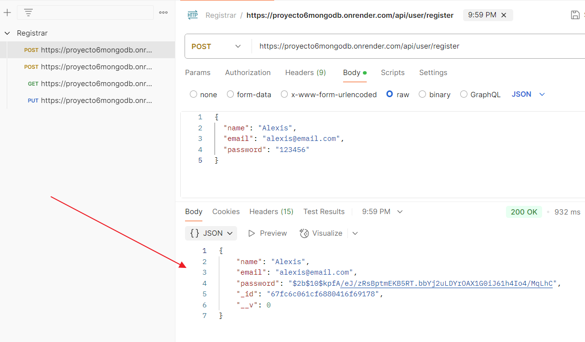

- **Login**
  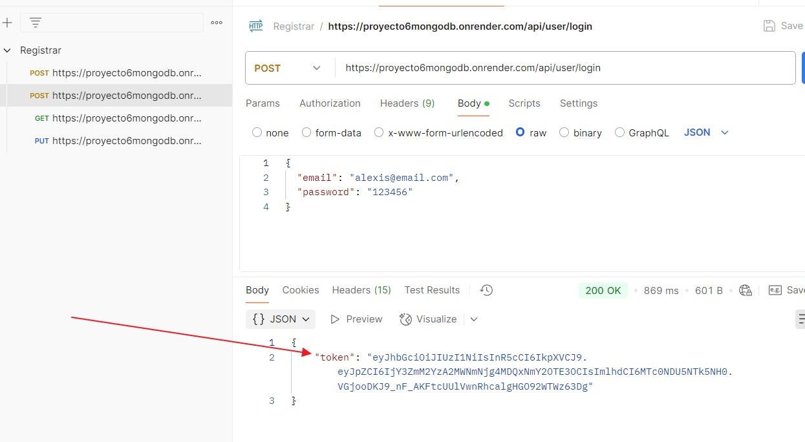

- **Authorization con Bearer Token**
  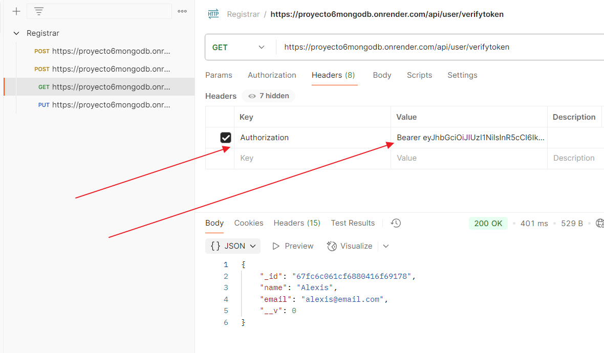

- **Verificar token**
  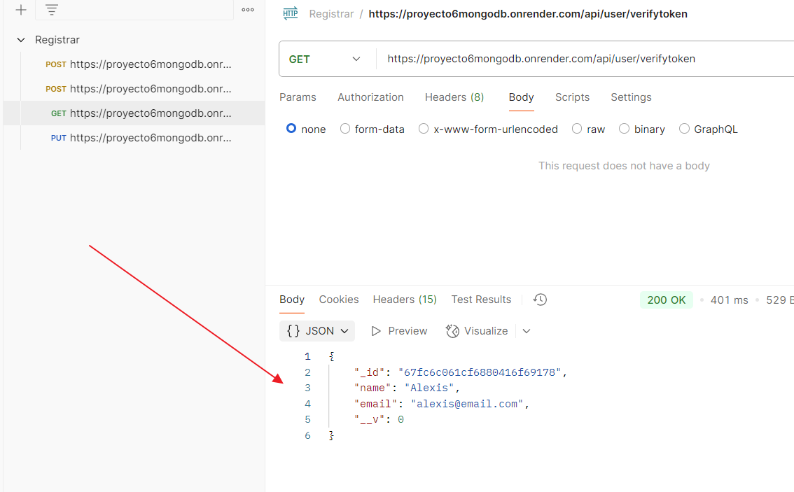

- **Actualizar usuario**
  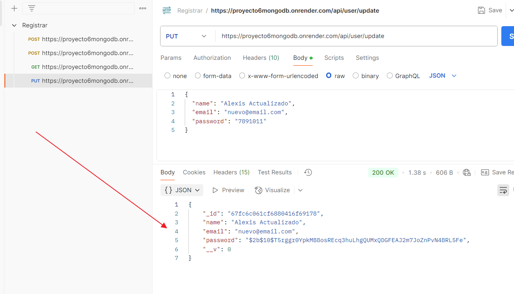

---

### 📦 Productos

- **Crear producto**
  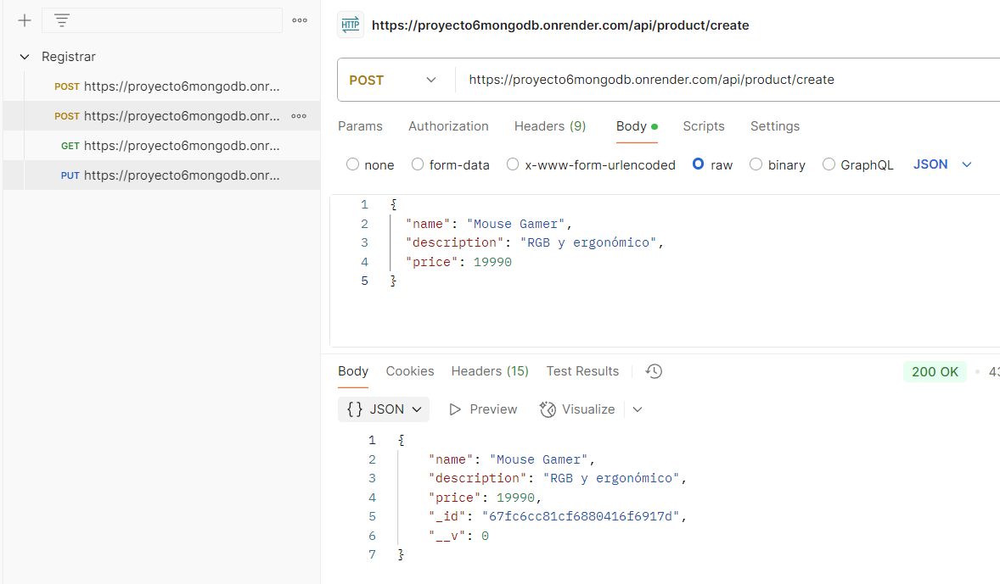

- **Actualizar producto**
  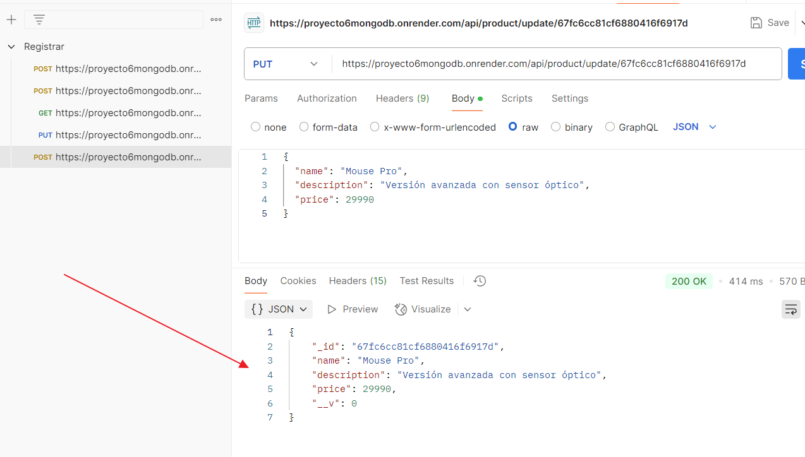

- **Leer todos los productos**
  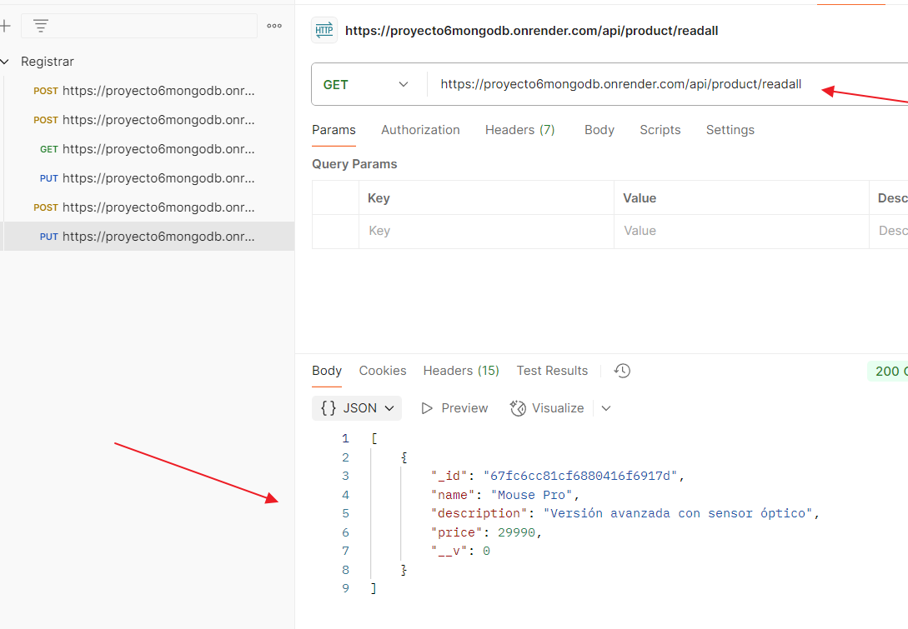

- **Leer producto por ID**
  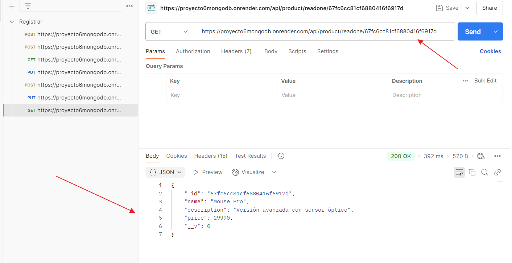

- **Eliminar producto por ID**
  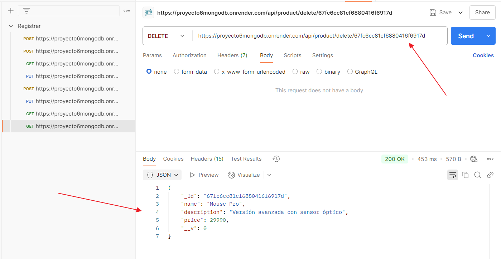

---

### 🧪 Verificación en MongoDB Compass

- **Visualización de documentos**
  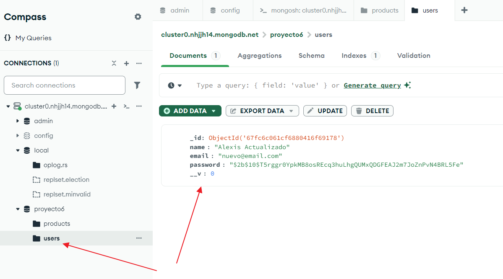
  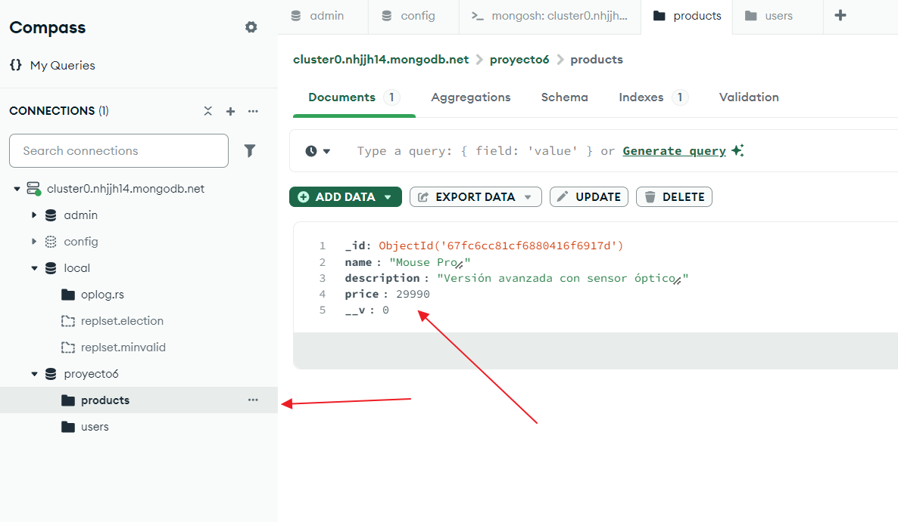
  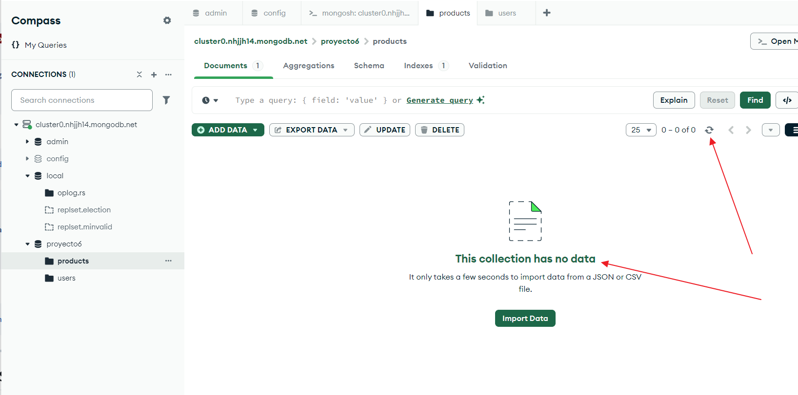
